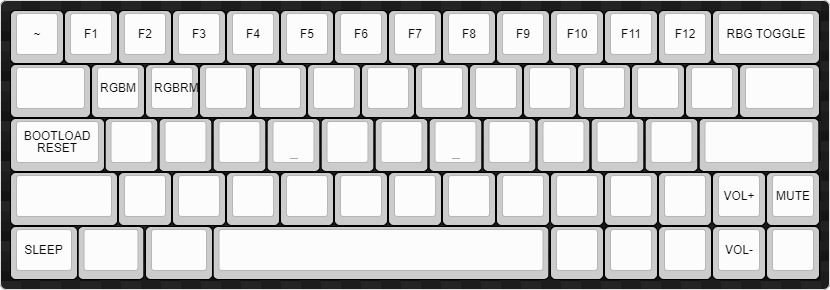

# Keymaps
Repository that I keep all my keymaps outside of the QMK repo. Uses QMK to flash the firmware.

##### DZ60 
Layer 0(default) Keymap for Ted's DZ60:

Layer 1(FN 1) Keymap for Ted's DZ60:

Layer 2(FN 2) Keymap for Ted's DZ60:

### Build
To build this keymap, insert the keymap into the correct directory, and run `make dz60:JergOP` 